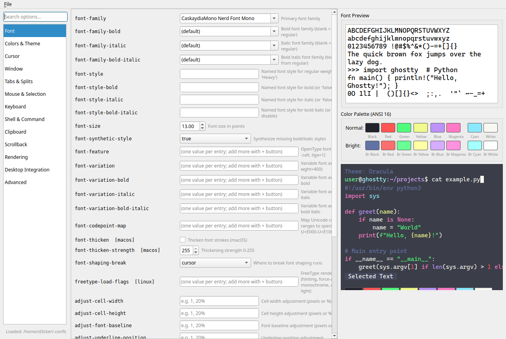
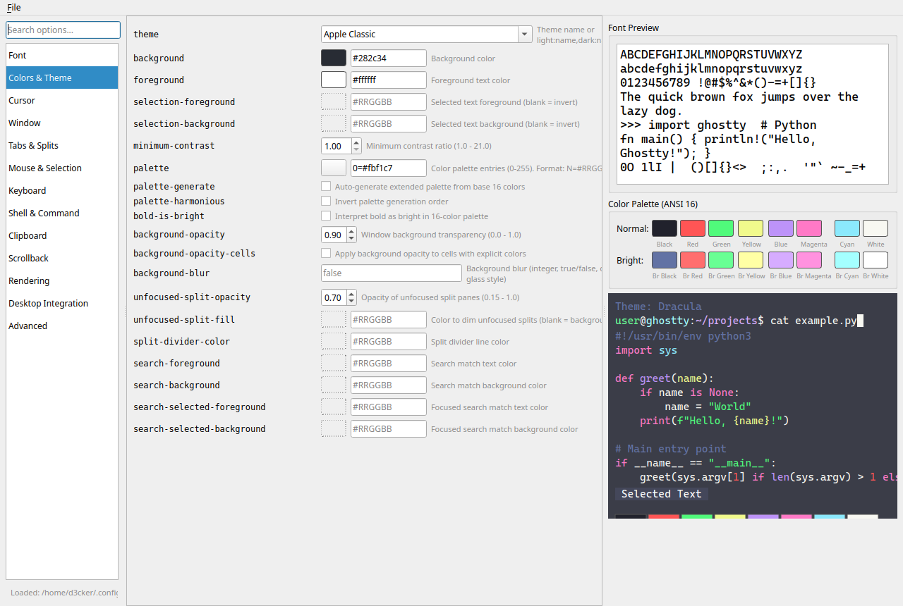

# Ghostty Config GUI

A Python/PyQt6 graphical configuration editor for [Ghostty](https://ghostty.org/) — a fast, feature-rich, cross-platform terminal emulator.

Ghostty uses a plain text config file (`~/.config/ghostty/config`). This app gives it a GUI with live previews.

> **Disclaimer:** This project was fully vibecoded with Claude Code and barely tested. Use at your own risk. It may eat your config, misrepresent options, or spontaneously combust. PRs welcome. Tested on Ubuntu 25.10. 

## Screenshots

| Font options & preview | Colors & theme preview |
|---|---|
|  |  |

## Features

- **100+ config options** organized into 13 categories (Font, Colors, Cursor, Window, Keyboard, Shell, etc.)
- **Theme browser** — dropdown with all installed Ghostty themes, live preview with syntax-highlighted code, palette, selection colors, and cursor
- **Font preview** — live sample text rendered with your selected font family and size
- **Color palette editor** — visual ANSI 16-color palette with clickable swatches and color pickers
- **Terminal preview** — simulated terminal showing syntax highlighting, cursor style, and fonts in real time
- **Search** — filter options by name or description
- **Config file I/O** — reads/writes `~/.config/ghostty/config.ghostty`, preserves comments and ordering. Only saves values you explicitly change
- **Dark theme** — Fusion dark UI

## Quick Start

```bash
python -m venv venv
source venv/bin/activate
pip install -r requirements.txt
python run_gui.py
```

## Config File Location

By default reads/writes `$XDG_CONFIG_HOME/ghostty/config` (usually `~/.config/ghostty/config`). Use File > Open to load a different file.

## License

I don't care, do whatever you want, I take no responsibility for this code or how it will be used.